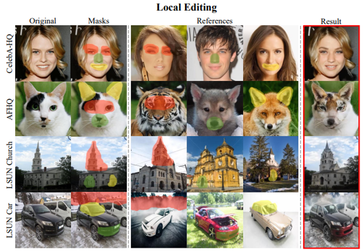
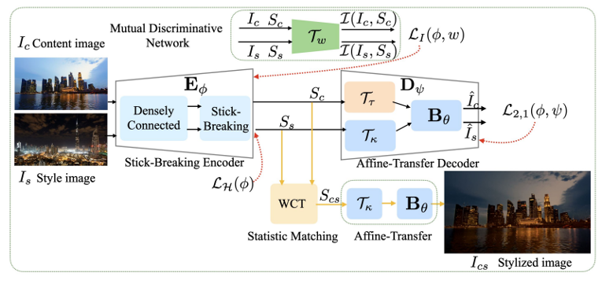
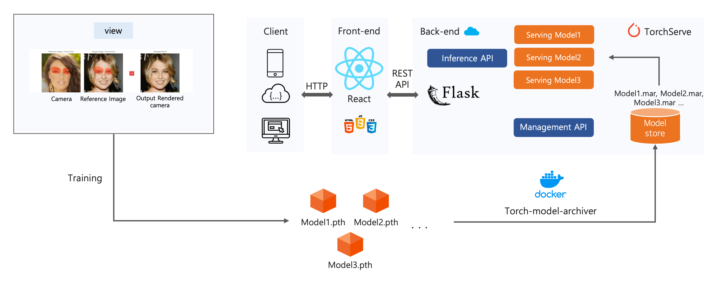
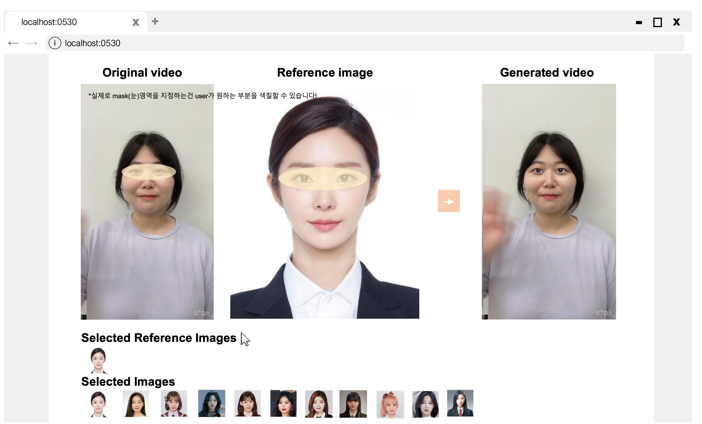

### Hi~ This is us 👋

안녕하세요, 저희는 Team **요르댕** 입니다.

AI와 Style Transfer에 관심을 갖고 있는 저희 멤버들은 Video face style editing 연구의 실생활에서의 구현과 실현에 앞장서 기여하고자 하는 마음을 갖고 모이게 되었습니다. Face Style Editing 기술을 많은 사람들에게 친숙한 video 매체에도 적용할 수 있도록 연구하고, 일반 유저들이 쉽게 사용할 수 있는 Interactive한 어플리케이션을 개발하고 있습니다.

저희는 현재 [Smilegate Membership AI 2기](https://careers.smilegate.com/student/membership) 프로그램에 지원하여 목표를 실현하기 위해 나아가고 있습니다.

<table align="center" width="788">
    <tbody>
        <tr>
            <td width="150" align="center">
                <table width="150" style="word-break:break-all; text-align: center;" >
                    <tbody>
                        <tr>
                            <td align="center">김하연</td>
                        </tr>
                        <tr>
                            <td>
                                
                            </td>
                        </tr>
                        <tr>
                            <td>팀장, Pipeline 개발</td>
                        </tr>
                        <tr>
                            <td >
                                <a href="mailto:rlagkdus705@unist.ac.kr">
                                    
                                </a>
                            </td>
                        </tr>
                        <tr>
                            <td>
                                <a href="https://github.com/Hayeon-kimm">
                                    
                                </a>
                            </td>
                        </tr>
                    </tbody>
                </table>
            </td>
            <!--  -->
            <td width="150" align="center">
                <table width="150" style="word-break:break-all; text-align: center;" >
                    <tbody>
                        <tr>
                            <td align="center">박규빈</td>
                        </tr>
                        <tr>
                            <td>
                                
                            </td>
                        </tr>
                        <tr>
                            <td>Video Knowledge</td>
                        </tr>
                        <tr>
                            <td >
                                <a href="mailto:gyubin.park@unist.ac.kr">
                                    
                                </a>
                            </td>
                        </tr>
                        <tr>
                            <td>
                                <a href="https://github.com/deschanel11">
                                    
                                </a>
                            </td>
                        </tr>
                    </tbody>
                </table>
            </td>
            <!--  -->
            <td width="150" align="center">
                <table width="150" style="word-break:break-all; text-align: center;" >
                    <tbody>
                        <tr>
                            <td align="center">장유진</td>
                        </tr>
                        <tr>
                            <td>
                                
                            </td>
                        </tr>
                        <tr>
                            <td>Feature Space</td>
                        </tr>
                        <tr>
                            <td >
                                <a href="mailto:softjin@unist.ac.kr">
                                    
                                </a>
                            </td>
                        </tr>
                        <tr>
                            <td>
                                <a href="https://github.com/hellog2n">
                                    
                                </a>
                            </td>
                        </tr>
                    </tbody>
                </table>
            </td>
            <!--  -->
            <td width="150" align="center">
                <table width="150" style="word-break:break-all; text-align: center;" >
                    <tbody>
                        <tr>
                            <td align="center">여상엽</td>
                        </tr>
                        <tr>
                            <td>
                                

                                

                            </td>
                        </tr>
                        <tr>
                            <td>Optimization</td>
                        </tr>
                        <tr>
                            <td >
                                <a href="mailto:sosick377@unist.ac.kr">
                                    
                                </a>
                            </td>
                        </tr>
                        <tr>
                            <td>
                                <a href="https://github.com/bwmelon97">
                                    
                                </a>
                            </td>
                        </tr>
                    </tbody>
                </table>
            </td>
            <!--  -->
            <td width="150" align="center">
                <table width="150" style="word-break:break-all; text-align: center;" >
                    <tbody>
                        <tr>
                            <td align="center">박수근</td>
                        </tr>
                        <tr>
                            <td>
                                
                            </td>
                        </tr>
                        <tr>
                            <td>Model Serving</td>
                        </tr>
                        <tr>
                            <td >
                                <a href="mailto:bwmelon97@unist.ac.kr">
                                    
                                </a>
                            </td>
                        </tr>
                        <tr>
                            <td>
                                <a href="https://github.com/bwmelon97">
                                    
                                </a>
                            </td>
                        </tr>
                    </tbody>
                </table>
            </td>
        </tr>
    </tbody>
</table>

### What we do
#### GAN을 이용한 실시간 Face Style Editing 웹 애플리케이션

저희가 만들고자 하는 것은 '**다른 사람의 얼굴과 나의 얼굴**의 일부분을 실시간 카메라 혹은 영상에서 "**원하는 만큼, 원하는 영역을**" **변환**하는 웹 기반 애플리케이션 서비스' 입니다. 이를 구현하기 위해 저희는 3가지 세부 목표를 설정했습니다.

1. **User Interactive Face Style Editing in Video**

   사용자가 직접 style editing에 관여하여 **원하는 만큼** 수정에 참여할 수 있는 서비스

2. **Semantic segmentation mask tracking**

   비디오의 모든 각각의 프레임에 대해 face style editing이 자연스럽게 유지

3. **Web based application**

   사용자가 쉽게 접근하고 사용하기 편한 UI를 제공하는 웹 어플리케이션 구현

저희 서비스의 모델을 개발하기 위해 필요한 핵심 기술을 찾아 학습하고, 적용합니다.

- [StyleMap GAN](https://github.com/naver-ai/StyleMapGAN)

  

  새로운 feature space인 w공간에 spatial resolution을 더하여, 타겟의 위치를 기억

  생성모델을 기반으로 데이터의 다양한 특성을 담은 manifold 학습

  위 manifold에서 image editing을 할 수 있도록 사용자의 controllability를 강화하여 사용자의 참여도를 높임

  Encoding 기반의 방법을 통한 manifold mapping 속도 향상

- NL_MAT

  

  기존 style transfer의 경우, global 혹은 local한 부분에 대해서만, 스타일 변환을 진행. 하지만, NL-MAT은 떨어져 있는 나무 2그루를 같은 정보로 인식함으로써, non-local한 부분에 스타일 변환을 진행

  픽셀을 color base의 선형 조합으로 분리하여 선형 조합의 계수를 feature의 representation으로 이용

  color base로부터 representation을 분리함으로써, 같은 representation(눈,코 등)에 대한 segmentation이 빠르게 진행 가능

#### Service Flow Diagram (Model Serving)

- 모델을 학습시키고 결과값을 추론하는 API는 TorchServe가 제공하는 Handler를 이용해 구현

- 이미지 및 영상 데이터 송수신은 REST API로 구현하며, 이에 대한 Back-end 구현은 Flask 프레임워크를 이용

- 클라이언트에 제공되는 UI 컴포넌트 및 웹 애플리케이션, Front-end 구현은 React 프레임워크 이용

#### Prototype

아래의 이미지를 클릭하면, 현재 저희가 만든 프로토타입의 시연영상을 확인하실 수 있습니다.

